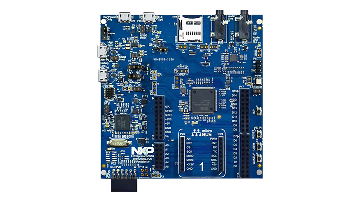

# TZ-DataShield (TZDS)

TZ-DataShield is a novel LLVM compiler tool that enhances ARM TrustZone with data-based compartmentalization, offering robust protection for sensitive data against strong adversaries in MCU-based systems.

## Environment

The following environments and hardware were used to perform the experiments for this project:

- Ubuntu 22.04
- [LPCXpresso55S69 development board](https://www.nxp.com/design/design-center/software/development-software/mcuxpresso-software-and-tools-/lpcxpresso-boards/lpcxpresso55s69-development-board:LPC55S69-EVK)



## Artifact Evaluation

### Connect to Remote Server

```sh
ssh -p 2222 tzds@107.211.15.224
```
(See password in *Artifact Appendix*)

### Experiment 1

[3human-minutes + 10 compute-minutes]

Sensitive Data Flow Identification

Open a new terminal and navigate to one application directory, for example, `adc`.

```sh
cd lpc_firmware
# use adc as example
cd adc
# install/update template code (including sdk)
./install-template.sh
make COMPILER=clang -j $(nproc)
make sdf
cat output/comp.yaml
```

The `.yaml` file shows the compartments, peripheral and shared global variables.

```
~/TZDS/lpc_firmware/adc$ make COMPILER=clang -j16
AS        startup/startup_LPC55S69_cm33_core0.S
CC        source/sys_tick.c
CC        source/main.c
CC        board/pin_mux.c
CC        board/peripherals.c
CC        board/clock_config.c
CC        utilities/debug_console/fsl_debug_console.c
CC        utilities/str/fsl_str.c
CC        components/serial_manager/fsl_component_serial_manager.c
CC        components/serial_manager/fsl_component_serial_port_uart.c
CC        components/uart/fsl_adapter_usart.c
CC        components/lists/fsl_component_generic_list.c
CC        drivers/fsl_lpadc.c
CC        drivers/fsl_usart.c
CC        drivers/fsl_flexcomm.c
CC        drivers/fsl_gpio.c
CC        drivers/fsl_reset.c
CC        drivers/fsl_power.c
CC        drivers/fsl_clock.c
CC        drivers/fsl_common_arm.c
CC        drivers/fsl_common.c
CC        LPC55S69/system_LPC55S69_cm33_core0.c
ASLL      .ir/source/sys_tick.c.ll
ASLL      .ir/source/main.c.ll
ASLL      .ir/board/pin_mux.c.ll
ASLL      .ir/board/peripherals.c.ll
ASLL      .ir/board/clock_config.c.ll
ASLL      .ir/components/serial_manager/fsl_component_serial_manager.c.ll
ASLL      .ir/components/serial_manager/fsl_component_serial_port_uart.c.ll
ASLL      .ir/components/uart/fsl_adapter_usart.c.ll
ASLL      .ir/components/lists/fsl_component_generic_list.c.ll
ASLL      .ir/drivers/fsl_flexcomm.c.ll
ASLL      .ir/drivers/fsl_gpio.c.ll
ASLL      .ir/drivers/fsl_reset.c.ll
ASLL      .ir/utilities/debug_console/fsl_debug_console.c.ll
ASLL      .ir/drivers/fsl_lpadc.c.ll
ASLL      .ir/utilities/str/fsl_str.c.ll
ASLL      .ir/drivers/fsl_usart.c.ll
ASLL      .ir/drivers/fsl_common_arm.c.ll
ASLL      .ir/LPC55S69/system_LPC55S69_cm33_core0.c.ll
ASLL      .ir/drivers/fsl_common.c.ll
ASLL      .ir/drivers/fsl_power.c.ll
ASLL      .ir/drivers/fsl_clock.c.ll
LLVMLINK  output/adc.ll
LLVMLINK  output/adc.bc
LD        output/adc.elf
GEN       compile_commands.json
Memory region         Used Size  Region Size  %age Used
    m_interrupts:         304 B        512 B     59.38%
          m_text:       41568 B     466432 B      8.91%
   m_core1_image:          0 GB       174 KB      0.00%
          m_data:        5840 B       204 KB      2.80%
    rpmsg_sh_mem:          0 GB         0 GB
      m_usb_sram:          0 GB        16 KB      0.00%
GEN       output/adc.hex
GEN       output/adc.bin
```

```
~/TZDS/lpc_firmware/adc$ cat output/comp.yaml
base:
  DbgConsole_Init, FLEXCOMM_GetInstance, FLEXCOMM_Init, FLEXCOMM_PeripheralIsPresent, FLEXCOMM_SetPeriph, HAL_UartGetStatus, HAL_UartInit, HAL_UartInitCommon, SerialManager_Init, SerialManager_OpenWriteHandle, Serial_UartInit, USART_EnableContinuousSCLK, USART_GetDefaultConfig, USART_Init, USART_SetBaudRate:
    - g_serialHandle
    - USART
  DbgConsole_Printf, ConvertFloatRadixNumToString, ConvertPrecisionWidthToLength, ConvertRadixNumToString, DbgConsole_PrintCallback, DbgConsole_SendDataReliable, DbgConsole_Vprintf, HAL_UartSendBlocking, PrintCheckFlags, PrintGetLengthFlag, PrintGetPrecision, PrintGetRadixFromobpu, PrintGetSignChar, PrintGetWidth, PrintIsdi, PrintIsfF, PrintIsobpu, PrintIsxX, PrintOutputdifFobpu, PrintOutputxX, SerialManager_StartWriting, SerialManager_Write, SerialManager_WriteBlocking, Serial_UartWrite, StrFormatExaminedi, StrFormatExamineobpu, StrFormatExaminexX, StrFormatPrintf, USART_WriteBlocking, modf, pow:
    - g_SensorData, g_serialHandle
    - USART
  LPADC_Init, LPADC_DoResetConfig, LPADC_DoResetFIFO0, LPADC_DoResetFIFO1, LPADC_Enable, LPADC_GetInstance:
    - ADC0_config
    - ADC
  LPADC_DoAutoCalibration, LPADC_FinishAutoCalibration, LPADC_GetConvResultCount, LPADC_GetGainConvResult, LPADC_PrepareAutoCalibration:
    -
    - ADC
  LPADC_SetConvCommandConfig:
    - ADC0_commandsConfig
    - ADC
  LPADC_SetConvTriggerConfig:
    - ADC0_triggersConfig
    - ADC
  LPADC_SetOffsetValue:
    -
    - ADC
  LPADC_EnableInterrupts:
    -
    - ADC
  LPADC_DoSoftwareTrigger:
    -
    - ADC
  MeasureTemperature:
    - g_SensorData
    -
  ADC0_IRQHandler, LPADC_GetConvResult:
    - g_SensorData, g_LpadcConversionCompletedFlag
    - ADC
joint:
  ReadTemperature:
    - g_LpadcConversionCompletedFlag
    - ADC
memory:
  peripheral:
    - USART
    - ADC
  marked:
    - g_SensorData
    - g_LpadcConversionCompletedFlag
  identified:
    - ADC0_config
    - ADC0_commandsConfig
    - ADC0_triggersConfig
    - g_serialHandle
  shared:
    - g_LpadcConversionCompletedFlag
    - g_SensorData
    - g_serialHandle
```

### Experiment 2

5 human-minutes + 20 compute-minutes

Compartmentalized Firmware Generation

Open a new terminal and navigate to one application directory, for example, `adc`.

```sh
cd lpc_firmware
# use adc as example
cd adc
# install/update template code (including sdk)
./install-template.sh
make COMPILER=clang -j $(nproc)
ls -l output/adc.hex
```

### Experiment 3

10 human-minutes

Download Firmware Images to MCU

Open a new terminal and navigate to one application directory, for example, `adc`. Then, open another terminal and run minicom-c on-b 115200-D /dev/ttyACM0 to open a serial terminal connected to the MCU.

**Terminal 1**:
```sh
cd lpc_firmware
# use adc as example
cd adc
# install/update template code (including sdk)
./install-template.sh
make COMPILER=clang -j $(nproc)
make download
```

**Terminal 2**:
```sh
minicom -c on -b 115200 -D /dev/ttyACM0
```

### Experiment 4

10 human-minutes + 10 compute-minutes

Over-approximation and Under approximation Rate

This experiment aims to measure the accuracy of TZ-DATASHIELD’s static analysis tool by using well-understood C/C++ programs with known data slices.

```sh
cd slicing_benchmark
cd make
```

### Experiment 5

SFI, CFI, and DFI Enforcement

This experiment aims to check if the SFI, CFI, and DFI mechanisms can block illegal access to global variables and peripherals. The attacks are implemented as maliciously modified compartments.

**Terminal 1**:
```sh
cd attacks
make a1 # a<attack number>
```

**Terminal 2**:
```sh
minicom -c on -b 115200 -D /dev/ttyACM0
```

```
~/TZDS/attacks/adc$ minicom -c on -b 115200 -D /dev/ttyACM0

Welcome to minicom 2.8

OPTIONS: I18n
Port /dev/ttyACM0

Press CTRL-A Z for help on special keys

Memory access outside compartment detected!
```


## Run TZDS

### Build toolchain

#### Build gcc (>30 minutes)
```sh
sudo apt update
sudo apt install build-essential
cd toolchain-gnu-bare-metal
./build.sh
```

#### Build llvm and clang (>20 minutes)
```sh
sudo apt install clang ninja-build
cd LLVM-embedded-toolchain-for-Arm
./build.sh
```

#### Build SVF (>5 minutes)
```sh
cd SVF
./build.sh
```

### Install toolchain
```sh
tar -xf toolchain-gnu-bare-metal/LLVMEmbeddedToolchainForArm-branch-14.tar.gz -C toolchain --strip-components=1
tar -xf LLVM-embedded-toolchain-for-Arm/LLVMEmbeddedToolchainForArm-branch-14.tar.gz -C toolchain --strip-components=1
```

### Install JLink udev rule

- Copy the file "99-jlink.rules" provided with this software package
  in the /etc/udev/rules.d/ directory using this command:
```sh
sudo cp 99-jlink.rules /etc/udev/rules.d/
```

- Either restart your system or manually trigger the new rules with the following commands:
```sh
sudo udevadm control -R
sudo udevadm trigger --action=remove --attr-match=idVendor=1366 --subsystem-match=usb
sudo udevadm trigger --action=add    --attr-match=idVendor=1366 --subsystem-match=usb
```

### Build firmware

- Connect the debug usb port of development board
```sh
cd lpc_firmware
# use i2c_sensor as example
cd i2c_sensor
# install/update template code (including sdk) from template project
./install-template.sh
make COMPILER=clang -j $(nproc)
```

- This command will generate the analysis results and and firmware:
    - original firmware
    - normal world firmware
    - secure world firmware
    - analysis results

Note that the normal world firmware and secure world firmware should be programed to the MCU together to work.

Sample data generate for compartmentalization can be find in `data-source` in this repo.
